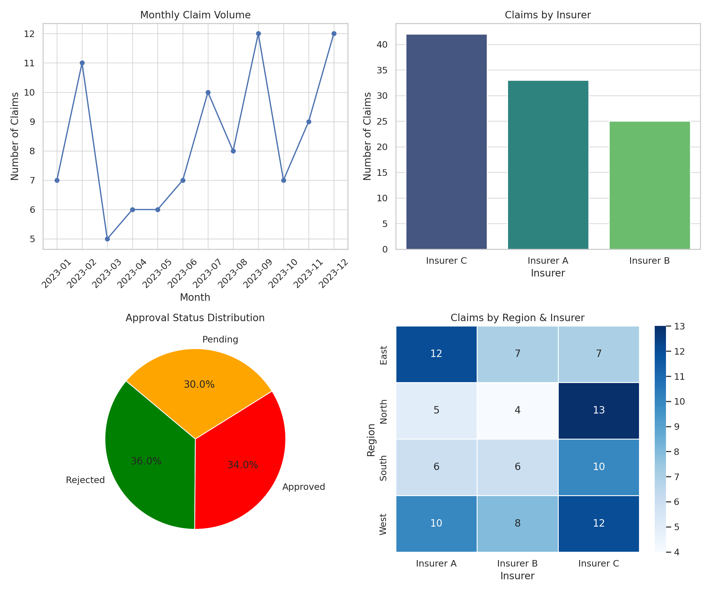

# TPA Claims Dashboard (Tableau)

## Overview
This project showcases an **interactive Tableau dashboard** for analyzing claims data from a **leading Third-Party Administrator (TPA) in India**. The dashboard provides insights into claim trends, approval rates, insurer performance, and regional distributions.

## Key Features
- **KPIs & Metrics:** Total claims, approval rates, average processing time.
- **Trend Analysis:** Monthly claim volume visualization.
- **Comparative Analysis:** Claims breakdown by insurer and region.
- **Approval Status Distribution:** Pie chart showing approvals, rejections, and pending claims.
- **Interactive Filters:** Users can filter data by date, insurer, region, and status.

## Technologies Used
- **Tableau** (Dashboard Development)
- **Python & Pandas** (Data Preprocessing & Cleaning)
- **Matplotlib & Seaborn** (Data Visualization for Analysis)
- **GitHub** (Version Control & Project Hosting)

## Dataset
- **File:** [TPA_Claims_Dataset.csv](./TPA_Claims_Dataset.csv)
- **Columns:**
  - `Claim_ID` - Unique claim identifier.
  - `Claim_Date` - Date of claim submission.
  - `Insurer` - Insurer handling the claim.
  - `Region` - Geographic region.
  - `Claim_Amount` - Amount claimed (in INR).
  - `Approval_Status` - Approved, Rejected, or Pending.
  - `Processing_Time_Days` - Number of days taken for processing.

## How to Use This Repository
1. **Clone the Repository:**
   ```sh
   git clone https://github.com/yourusername/TPA_Claims_Dashboard.git
   ```
2. **Open Tableau Desktop and Import the Dataset.**
3. **Use the provided Tableau workbook (.twbx) to explore the dashboard.**
4. **Modify filters and visualizations as needed.**

## Dashboard Preview


## Tableau Public Link
🔗 **[View Live Dashboard](https://public.tableau.com/profile/yourname)** *(Replace with your actual Tableau Public link)*

## Contributing
Feel free to fork this repository, improve the visualizations, and submit a pull request! 🚀

## License
This project is open-source and available under the **MIT License**.

